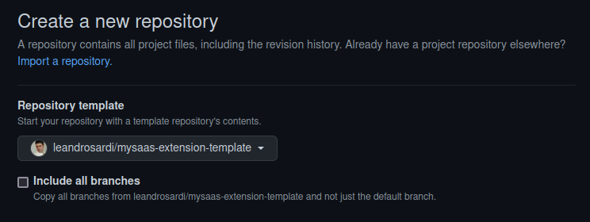

# mysaas-extension-template


This repository has all the files and folders you need to create a new extension of [MySaaS](https://github.com/leandrosardi/mysaas). 

When starting a new extension, **fork** this repository or use it as a **template** as well.

.

<!extension-description-here!>

## Getting Started

Just add the extension into the `config.rb` file of your [MySaaS](https://github.com/leandrosardi/mysaas) project.

```ruby
BlackStack::Extensions.append :<!your-github-repo-name-for-this-extension!>
```

## API

_(write API documentation here)_

## Screens

_(showcase app screens here)_

## AJAX & Filters

_(write screens workflow here, describing calls to AJAX and Filters)_

## Disclaimer

The logo has been taken from [here](https://www.shareicon.net/designer-lego-136206).